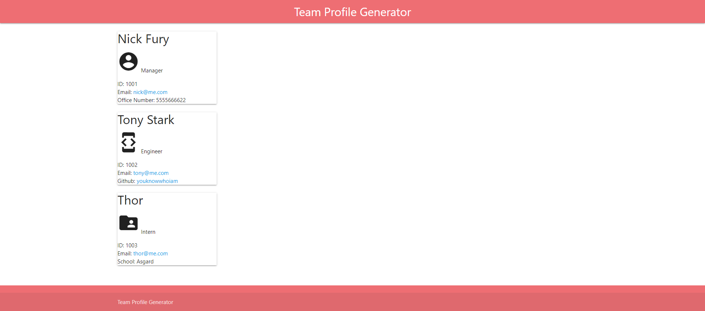

# TeamProfile-Generator

## Table of Contents
-[Description](#description)

-[Installation](#installation)

-[Usage](#usage)

-[Contributions](#contributions)

-[Tests](#tests)

-[License](#license)

-[Questions](#questions)
## Description
This TDD app generates an HTML template with cards for managers to have access to employee information. Styling was done with Materialize CSS.

Please follow [link to application demo video.](https://www.youtube.com/watch?v=KxlkwN0Bdzs)
## Installation
Clone this repo and run npm install and run the app in the terminal. 
## Usage
Answer the necessary questions and you will be returned an HTML file.
## Contributions
Contributions are open for styling.
## Tests
TDD app, you can run tests.
## License
The MIT License
## Questions
If you have questions about this project pleas contact me:
GitHub: https://github.com/00anp/
E-mail: alfonso.nunez29@gmail.com